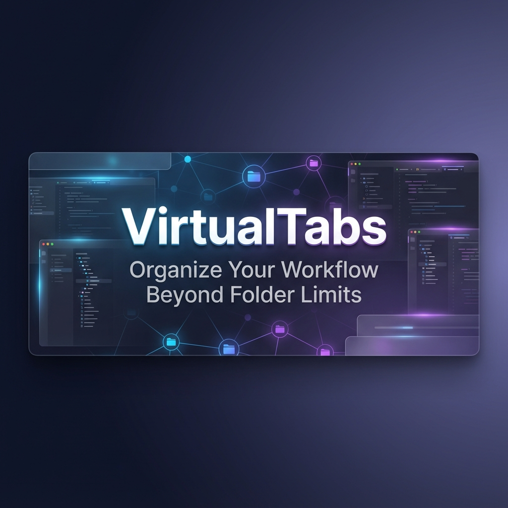
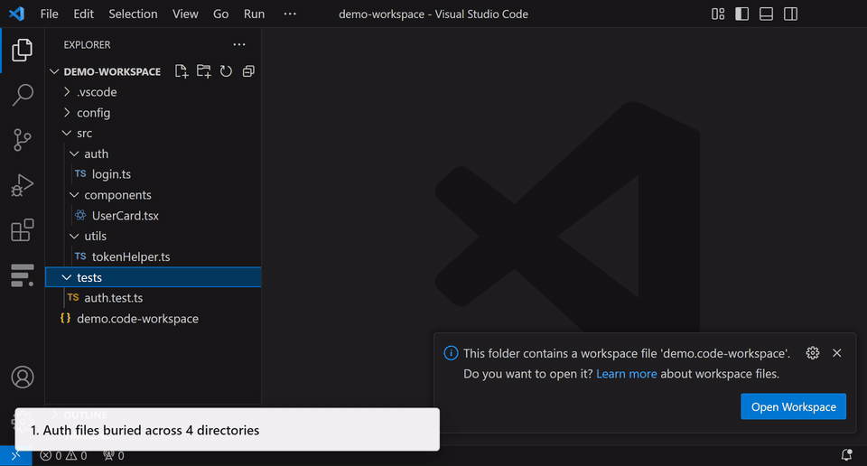

# VirtualTabs - VS Code の仮想タブ / カスタムファイルグループ拡張

[](https://marketplace.visualstudio.com/items?itemName=winterdrive.virtual-tabs)
[](https://open-vsx.org/extension/winterdrive/virtual-tabs)
[](https://open-vsx.org/extension/winterdrive/virtual-tabs)
[](https://winterdrive.github.io/vscode-virtual-tabs/llms.txt)

[繁體中文](README.zh-TW.md) | [English](../README.md) | 日本語 | [한국어](README.ko.md) | [简体中文](README.zh-CN.md)



---

## VirtualTabs とは？

**VirtualTabs は、実際のファイルシステムとは別に、タスク単位の「仮想ファイルディレクトリ」を作れる VS Code 拡張です。** ファイルを移動したりコピーしたりせず、現在の作業テーマに合わせて永続的な論理グループを作成し、AI-ready context として一括コピーできます。Monorepo、MVC、MVVM、大規模プロジェクトに向いています。


## Quick Start



1. VS Code Marketplace で **VirtualTabs** を検索してインストールします。
2. Activity Bar から **VirtualTabs** ビューを開きます。
3. パネルまたはスコープ見出しを右クリックして、新しいグループを作成します。
4. Explorer からファイルやフォルダーをグループへドラッグします。
5. グループを右クリックし、**Copy... -> Copy Context for AI** で ChatGPT、Claude、Copilot 向けの文脈をコピーします。

## 主な機能

- **クロスディレクトリのグループ化**：場所が違う関連ファイルを同じ論理グループにまとめます。
- **タスク指向ブックマーク**：重要なコード行をグループ内で記録し、すぐに戻れます。
- **サブグループとネスト**：複雑な機能を階層構造で整理できます。
- **AI Context Export**：グループ内のファイルを LLM が読みやすい Markdown としてコピーします。
- **ポータブル設定**：グループ情報は `.vscode/virtualTab.json` に保存され、チームで共有できます。
- **MCP 連携**：Model Context Protocol 経由で AI agent がグループを操作できます。
- **Agent Skill Installer**：**VirtualTabs: Install Agent Skill** を実行して公式 `virtualtabs` skill をインストールします。特定 agent 向け skill/rule ファイルを手動で書き出す必要がある場合だけ、**Generate Skill Files Manually** を使います。
- **Multi-root scope**：multi-root workspace ではプロジェクトごとにグループを分離します。
- **Send to...**：選択したファイルやグループを設定済みの送信先へ送れます。
- **ファイル順序変更**：ドラッグ＆ドロップまたはショートカットで順序を調整できます。

## MCP と Agent Skills

VirtualTabs には MCP server が組み込まれており、**VirtualTabs: Show MCP Config** パネルから AI クライアント向けの設定をコピーできます。接続後、Cursor、Claude、Copilot、Kiro、Antigravity などの agent は、グループの一覧取得、作成、ファイル追加、ブックマーク管理、AI context の出力を実行できます。

**VirtualTabs: Install Agent Skill** を実行し、**Auto Install (Recommended)** を選んで公式 `virtualtabs` skill をインストールします。同じインストールコマンドを直接実行することもできます：

```bash
npx skills add winterdrive/vscode-virtual-tabs
```

特定 agent 向け skill/rule ファイルを手動で書き出す必要がある場合だけ、**Generate Skill Files Manually** を選びます。生成される内容には、VirtualTabs のグループが実ファイルシステム上のフォルダーではなく仮想グループであることも明示されます。

詳しくは [MCP Setup Guide](mcp-setup.md) を参照してください。

## 推奨コンパニオン

**Quick Prompt** は VirtualTabs と相性の良い補助ツールです。VirtualTabs はファイルをタスク単位で整理し、Quick Prompt は IDE 内でアイデアや次の作業を記録します。

## Support

- [Bug reports / feature requests](https://github.com/winterdrive/virtual-tabs/issues)
- [Changelog](../CHANGELOG.md)
- [Development guide](../DEVELOPMENT.md)

**License**: [MIT](../LICENSE)
